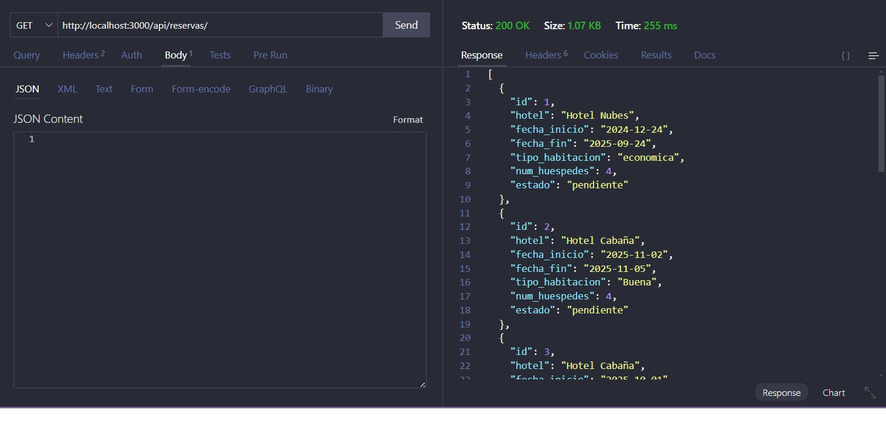
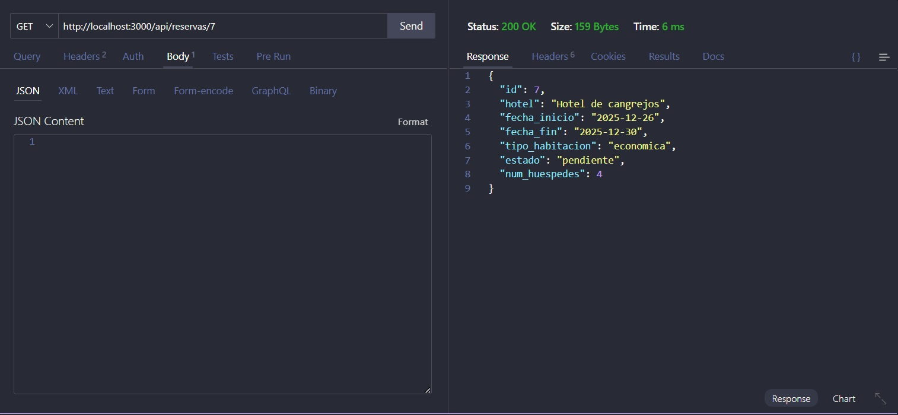
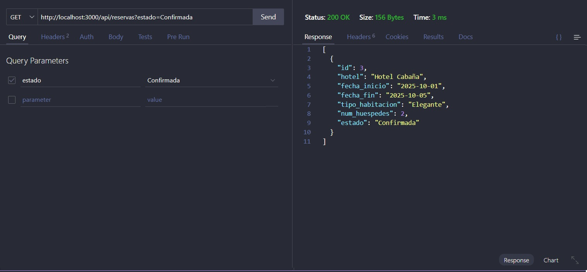
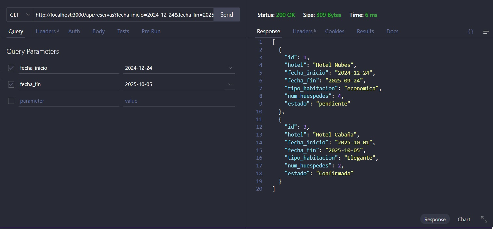
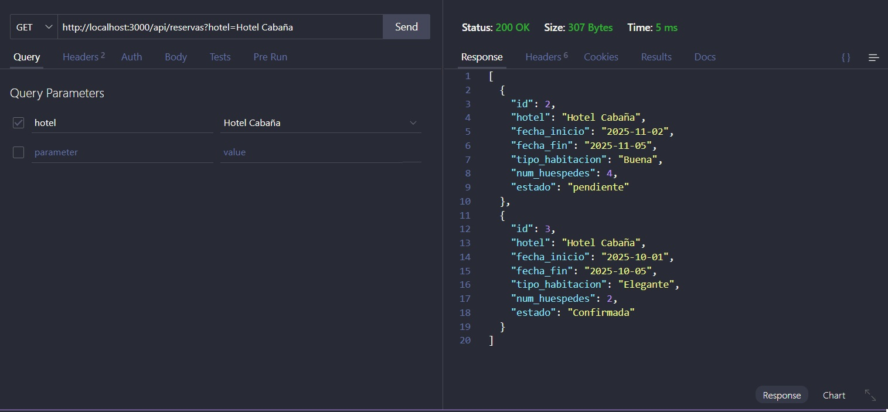
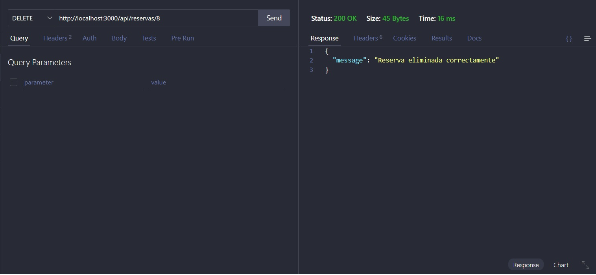
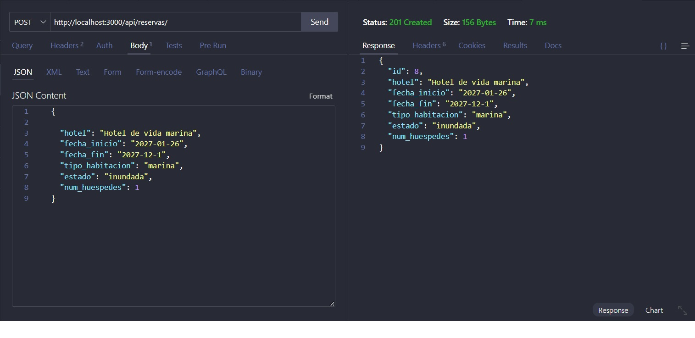
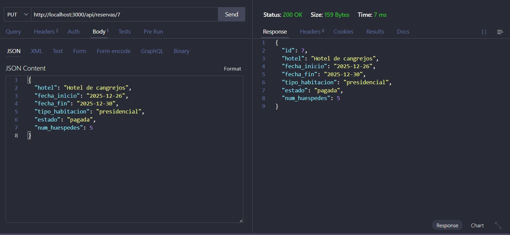

# 🏨 API de Reservas de Hotel

Este es un proyecto backend desarrollado con Node.js y Express para gestionar reservas de hotel, con funcionalidades CRUD completas. Las reservas se almacenan en un archivo JSON local.
## 📁 Estructura de Archivos 
```text

.
├── assets
│   ├── config/          # Configuración general (Swagger, etc.)
│   ├── controllers/     # Lógica de negocio de las reservas
│   ├── data/            # Archivos de datos locales (reservas.json)
│   └── routes/          # Definición de rutas de la API
├── .env                 # Variables de entorno
├── .gitignore
├── .prettierrc          # Configuración de Prettier
├── package.json
├── package-lock.json
└── server.js            # Punto de entrada principal
```
## 🚀 Despliegue

La API está desplegada en Render y disponible en:
 [https://proyecto-4-reservas-hotel.onrender.com/api-docs/](https://proyecto-4-reservas-hotel.onrender.com/api-docs/)

## 🧩 Endpoints disponibles
```text
POST /api/reservas/
```
Crear una nueva reserva.
```text
GET /api/reservas/
```
Obtener todas las reservas. Puedes aplicar filtros por query string:
```text
-hotel
-fecha_inicio
-fecha_fin
-tipo_habitacion
-estado
-num_huespedes
```
```text
GET /api/reservas/:id
```
Obtener una reserva específica por ID.
```text
PUT /api/reservas/:id
```
Actualizar una reserva existente por ID.
```text
DELETE /api/reservas/:id
```
Eliminar una reserva por ID.

## 📦 Ejemplo de Objeto de Reserva
```text
{
  "id": 1, 
  "hotel": "Hotel Nubes",
  "fecha_inicio": "2024-12-24",
  "fecha_fin": "2025-01-02",
  "tipo_habitacion": "doble",
  "estado": "confirmada",
  "num_huespedes": 2
}
```
## 🛠 Tecnologías Utilizadas
```text
-Node.js
-Express.js
-Swagger UI
-dotenv
-fs/promises
-datejs
```

## 👀 Pruebas en Thunder client

A continuación se presentan pruebas de las funcionalidades
```text
GET /api/reservas/
```

```text
GET /api/reservas/:id
```

```text
GET filtros query
```




```text
DELETE /api/reservas/:id
```

```text
POST /api/reservas/
```

```text
PUT /api/reservas/:id
```

